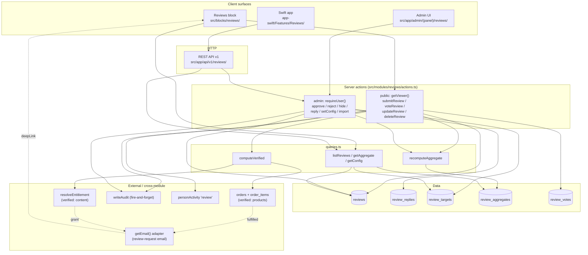

# TECH-SPEC — Reviews

**Feature:** User-generated reviews & ratings (polymorphic, any reviewable target)
**Date:** 2026-07-06
**Status:** Approved — documentation only. This spec records the locked design; it does not re-open decisions.
**Companion docs:** `EXECUTIVE-SUMMARY.md` (short), `research/codebase-audit.md`, `research/industry-research.md`, `migrations/README.md`.

> **Note on existing artifacts:** `src/modules/reviews/schema.ts` and `src/modules/reviews/validation.ts` already exist and match this spec. `src/lib/db/schema/index.ts` already re-exports the reviews schema, and `"review"` is already in the `personActivity` type enum (`src/modules/people/schema.ts:42`). The remaining work is `queries.ts`, `actions.ts`, `email.ts`, `admin/`, `public/`, the block, the API routes, the admin routes, and the Swift app.

---

## 1. Executive Summary

The Lamina platform gains a single, polymorphic reviews & ratings system that attaches to **any reviewable target** — products, entries (by entity), custom types (by slug), pages, and posts — via a `targetType`/`targetId` pair. It mirrors the platform's existing `block_sets.ownerType`/`ownerId` polymorphic convention, so it scales with the custom-types system without a migration per type.

The system is login-gated (`getViewer()` via `person_session`), computes a **verified** flag at submit time (products via `orders`+`orderItems`; content via `resolveEntitlement`), supports per-target-type config (moderation `pre`/`post`, verified gate `required`/`optional`, comment-only mode), caches aggregates that recompute on every status change, and emits `Schema.org` JSON-LD for rich snippets. It surfaces four ways: a drop-in **reviews block**, **review-request emails**, a **REST API v1**, and a **Swift** companion app. Moderation is a simple manual queue (ML deferred). v1 ships five tables, a `src/modules/reviews/` module mirroring `commerce/`, and admin + API + Swift surfaces.

The design is deliberately conservative: simple mean aggregation (not weighted/decayed), enrollment-gated (not completion-gated) verification, console-only email in dev, and a pre/post moderation toggle rather than ML auto-approval. Each deferral is a documented open question with a no-migration upgrade path.

---

## 2. Background & Scope

### 2.1 Problem

The platform has no user-generated reviews. Two review-adjacent blocks exist — `src/blocks/rating/` (static display) and `src/blocks/testimonial/` (static curated quotes) — but neither accepts or persists end-user input. Commerce sells products, entries/custom-types model content, and memberships gate access, yet there is no way for a customer or member to rate or review what they bought or consumed, and no way for prospective buyers to see aggregate social proof. This is a table-stakes gap for a commerce + content + membership platform.

### 2.2 Goals (v1)

- **One system, many targets.** A single reviews subsystem that works for products, entries, custom types, pages, and posts without per-type code.
- **Verified signal.** Compute whether a reviewer actually transacted with / is entitled to the target, at submit time, and surface it as a badge. This is both a conversion lever (verified reviews convert better) and a compliance posture (FTC 2024 fake-review rule).
- **Configurable, not hardcoded.** Moderation policy, verified gate, login requirement, and rating-vs-comment mode are **per target type**, with documented defaults and row-absent = defaults.
- **Four surfaces.** Drop-in block, review-request emails, REST API v1, Swift app.
- **SEO.** `Schema.org AggregateRating` + `Review` JSON-LD for rich snippets.
- **Consistency.** Mirror existing module/block/API/admin conventions exactly (see `research/codebase-audit.md`).

### 2.3 Non-goals (v1)

- **ML/automated moderation.** v1 is a manual queue + pre/post toggle.
- **Weighted/decayed aggregation.** v1 is simple mean + count, recomputed on status change.
- **Course-completion verification.** The platform doesn't track completion yet; v1 gates on enrollment.
- **Real email driver.** The adapter is console-only in dev; a real driver is out of v1 scope. The trigger is wired so a driver is a drop-in.
- **Auto-injection into detail templates.** v1 surfaces via the drop-in block, not by mutating product/entry/page render templates. (Future: auto-inject.)
- **Half-star ratings.** Integer 1–5 only.
- **Multi-reply threading.** One owner reply per review (Udemy-style).

### 2.4 Locked user decisions

| Decision | Locked value |
|---|---|
| Moderation | Configurable per target type; **default post-moderate** (visible immediately, admin can hide) |
| Reviewer identity | **Require login** (people account via `getViewer()`, `person_session` cookie) |
| Verified gate | Configurable per target; **default optional badge** (anyone can review; verified shown with badge) |
| v1 surfaces | Reviews block (drop-in), review-request emails, REST API v1 + Swift app (**not** auto-inject into detail templates) |

---

## 3. Architecture

### 3.1 Module layout

A new `src/modules/reviews/` module mirrors the established pattern (`schema.ts`, `queries.ts`, `actions.ts`, `validation.ts`, `admin/`, `public/`):

```
src/modules/reviews/
  schema.ts          # ✓ exists — 5 tables
  validation.ts      # ✓ exists — Zod schemas
  queries.ts         # read-side + computeVerified + recomputeAggregate
  actions.ts         # server actions (public + admin)
  email.ts           # sendReviewRequestEmail via getEmail() adapter
  admin/             # admin-only helpers
  public/            # storefront helpers (ReviewsRenderer, ReviewForm, ReviewCard)
```

### 3.2 Data flow



**Reads:** Block resolve / API list / admin queue → `queries.ts` → `reviews` + `review_aggregates` + `review_targets` (+ `review_replies`, `review_votes` as needed).

**Writes:** Public submit → `computeVerified` (joins `orders`/`orderItems` or `resolveEntitlement`) → insert `reviews` (status per moderation policy) → `recomputeAggregate` (upsert `review_aggregates`) → `writeAudit` + `personActivity{type:"review"}`.

**Moderation:** Admin approve/reject/hide → update `reviews.status` → `recomputeAggregate` → `writeAudit` → `revalidateTag("reviews")`.

**Email:** Order fulfillment / entitlement grant → `sendReviewRequestEmail` via `getEmail()` → deep link back to the block.

### 3.3 Verified computation (`queries.ts: computeVerified`)

`computeVerified(personId, targetType, targetId, viewer?)` returns `{ verified, method, ref }`:

- **`targetType === "product"`:** join `orders` + `order_items` where `orders.personId = personId AND order_items.productId = targetId AND orders.status IN ("paid","fulfilled")`. If found → `{ verified: true, method: "order", ref: orderId }`. Computed at query time (no precomputed flag, by design).
- **`targetType` in `entry:*` / `custom:*` / `page` / `post`:** check `resolveEntitlement` (`src/modules/entitlements/gate.ts`) against the target's gate. If the target is membership- or pack-gated and the viewer passes → `{ verified: true, method: "enrollment" | "membership", ref: entitlementRef }`. **Course-completion tracking doesn't exist yet; v1 gates on enrollment, not completion.**
- Otherwise → `{ verified: false, method: "none", ref: null }`.

`verified` is **stored** on the review at submit and rechecked on edit (so a reviewer who later buys the product can become verified, and a lapsed member can lose it). The stored value is what the badge renders; `computeVerified` is the source of truth at write time.

### 3.4 Aggregate recomputation (`queries.ts: recomputeAggregate`)

On every review `status` change (new submit that is immediately `approved`, approve, reject, hide, delete), recompute `review_aggregates` for `(targetType, targetId)`:

- `count` = number of `approved` reviews with `rating > 0`.
- `average` = mean of those ratings (real).
- `distribution` = `[n1, n2, n3, n4, n5]` counts per star.
- `computedAt` = now.

Upsert (composite PK `(targetType, targetId)`). This is synchronous within the action so the storefront never reads a stale aggregate. (Weighted/decayed average is a documented future enhancement, computable from `distribution` without a migration.)

### 3.5 One-review-per-person

A unique index `(personId, targetType, targetId)` enforces one review per person per target. The supported edit path is **edit-in-place** (`updateReview`) rather than re-submit. This also means the `helpfulVotes` counter on `reviews` is the cached length of `review_votes` for that review.

---

## 4. Schema Changes

All five tables are defined in `src/modules/reviews/schema.ts` (✓ exists) and re-exported via `src/lib/db/schema/index.ts` (✓ wired). Migrations are **generated** by `npm run db:generate` (drizzle-kit) — see `migrations/README.md`. No hand-written SQL.

### 4.1 `reviews` — the polymorphic review row

| Column | Type | Notes |
|---|---|---|
| `id` | text PK | cuid via `createId` |
| `targetType` | text notNull | `"product"` \| `"entry:<entity>"` \| `"custom:<slug>"` \| `"page"` \| `"post"` |
| `targetId` | text notNull | polymorphic — no FK (existence checked in app logic) |
| `personId` | text notNull | reviewer — a `people` row |
| `rating` | int notNull default 0 | 1–5, or **0 = comment-only** (when `allowRating:false`) |
| `title` | text notNull default "" | ≤120 |
| `body` | text notNull default "" | ≤5000 |
| `photos` | json `string[]` notNull default [] | mediaIds (resolved via media module) |
| `status` | enum `pending\|approved\|rejected\|hidden` notNull default `pending` | |
| `moderationNote` | text notNull default "" | admin-visible only |
| `verified` | bool notNull default false | set from `computeVerified` at submit, rechecked on edit |
| `verifiedMethod` | enum `order\|enrollment\|membership\|none` notNull default `none` | |
| `verifiedRef` | text nullable | orderId (products) or entitlement/membership ref |
| `helpfulVotes` | int notNull default 0 | cached length of `review_votes` for this review |
| `meta` | json `Record<string,unknown>` notNull default {} | type-specific extras (completion %, dimension ratings, reaction) |
| `source` | enum `web\|email\|api\|import` notNull default `web` | |
| `at` / `updatedAt` | int notNull | `Date.now()` |

**Indexes:** `(targetType, targetId, status)`, `(personId)`, **unique** `(personId, targetType, targetId)` (one review per person per target).

### 4.2 `review_replies` — owner reply (one per review)

| Column | Type |
|---|---|
| `id` | text PK (cuid) |
| `reviewId` | text notNull |
| `body` | text notNull (≤2000) |
| `byUserId` | text notNull (admin user who replied) |
| `at` / `updatedAt` | int notNull |

One reply per review, enforced in app logic (Udemy-style: removed if the student updates their review — re-implement as delete-then-re-reply on update).

### 4.3 `review_targets` — per-target-type config (PK = `targetType`)

| Column | Type | Default | Notes |
|---|---|---|---|
| `targetType` | text PK | — | e.g. `"product"`, `"custom:courses"` |
| `enabled` | bool | true | |
| `moderation` | enum `pre\|post` | `post` | post = visible immediately, admin can hide |
| `verifiedGate` | enum `required\|optional` | `optional` | required = only verified reviewers can submit |
| `requireLogin` | bool | true | |
| `allowRating` | bool | true | **false = comment-only** (Patreon-style; rating stored as 0) |
| `minRating` | int | 1 | |
| `maxRating` | int | 5 | |
| `updatedAt` | int | now | |

**Row absent = defaults.** A row is created only the first time the owner customizes a target type.

### 4.4 `review_aggregates` — cached aggregate (composite PK)

| Column | Type |
|---|---|
| `targetType` + `targetId` | composite PK |
| `average` | real default 0 |
| `count` | int default 0 |
| `distribution` | json `number[]` default `[0,0,0,0,0]` (`[1★..5★]`) |
| `computedAt` | int default now |

Recomputed synchronously on every review status change.

### 4.5 `review_votes` — helpful votes (composite PK)

| Column | Type |
|---|---|
| `reviewId` + `personId` | composite PK (prevents double-voting) |
| `at` | int default now |

`reviews.helpfulVotes` is the cached count derived from this table.

### 4.6 Cross-module change

`src/modules/people/schema.ts:42` — the `personActivity` `type` enum already includes `"review"`:
```
enum: ["view", "form", "order", "subscribe", "login", "note", "review"]
```
No schema change required for the activity type. (`submitReview` writes a `personActivity` row with `type: "review"`.)

---

## 5. API Contracts

### 5.1 Server actions (`src/modules/reviews/actions.ts`)

All return `Result<T>`. All mutations `writeAudit(...)` and `revalidateTag("reviews")` / `updateTag("reviews")`.

**Public (auth via `getViewer()`):**

| Action | Behavior |
|---|---|
| `submitReview(input)` | Enforce login (null viewer → fail). Enforce one-per-person (unique idx). Rate-limit reuse `forms/rate-limit.ts` pattern keyed `review:<targetType>:<targetId>\|<personId\|ip>`. Resolve target config (`review_targets` row or defaults). If `verifiedGate==="required"`, run `computeVerified` and reject if not verified. Set `status` per moderation policy (`post`→`approved`, `pre`→`pending`). Set `verified`/`verifiedMethod`/`verifiedRef` from `computeVerified`. Insert. `recomputeAggregate`. `writeAudit({action:"review.submit"})`. Write `personActivity{type:"review"}`. |
| `voteReview(reviewId)` | Toggle `review_votes` row for `(reviewId, personId)`; update cached `reviews.helpfulVotes`. Rate-limited. Login required. |
| `updateReview(id, patch)` | Owner edits own review (matched on `personId`). Recheck `computeVerified`. Recompute aggregate if rating/status changed. |
| `deleteReview(id)` | Owner deletes own review (matched on `personId`). Recompute aggregate. |

**Admin (auth via `requireUser()`):**

| Action | Behavior |
|---|---|
| `approveReview(id)` | `status`→`approved`. Recompute aggregate. `writeAudit({action:"review.approve"})`. |
| `rejectReview(id, note?)` | `status`→`rejected`, set `moderationNote`. Recompute aggregate. |
| `hideReview(id)` | `status`→`hidden`. Recompute aggregate. |
| `replyToReview(id, body)` | Upsert `review_replies` (one per review). `byUserId` = current user. |
| `setReviewTargetConfig(targetType, patch)` | Upsert `review_targets` row. |
| `importReviews(rows)` | Bulk insert (source `"import"`); skips `computeVerified` (trusted import). Recompute affected aggregates. |

### 5.2 REST API v1 (`src/app/api/v1/reviews/`)

Bearer auth via `requireApiUser()`. Envelope `{ok:true,data} | {ok:false,error}` via `handle/ok/fail/parseBody` from `@/lib/api/v1`. Mutations `writeAudit` + `revalidateTag("reviews")`. Mirrors `src/app/api/v1/products/route.ts`.

| Route | Method | Purpose |
|---|---|---|
| `/api/v1/reviews` | GET | List with filters: `targetType`, `targetId`, `status`, `rating`, `sort` (`recent\|helpful\|highest\|lowest`), `limit`, `cursor`. |
| `/api/v1/reviews` | POST | Create (body validated against review schema; mirrors admin `submitReview` semantics, `source:"api"`). |
| `/api/v1/reviews/[id]` | GET | Single review (+ reply, + vote count). |
| `/api/v1/reviews/[id]/approve` | POST | Approve. |
| `/api/v1/reviews/[id]/reject` | POST | Reject (optional `note`). |
| `/api/v1/reviews/[id]/hide` | POST | Hide. |
| `/api/v1/reviews/[id]/reply` | POST | Owner reply (body). |
| `/api/v1/reviews/aggregate` | GET | `?targetType=&targetId=` → `{average, count, distribution}`. |
| `/api/v1/reviews/review-targets` | GET / POST | List / upsert per-target config. |
| `/api/v1/reviews/review-targets/[targetType]` | GET / PATCH / DELETE | Read / update / reset one target config. |

### 5.3 Email (`src/modules/reviews/email.ts`)

```ts
sendReviewRequestEmail(to: string, { targetType, targetId, deepLink }): Promise<void>
```

Calls `getEmail()` (adapter from `src/adapters/types.ts`; console impl in dev). Fired by:
- **Order fulfillment** — `src/modules/commerce/order-actions.ts` status→`fulfilled` (≈ line 41) calls `sendReviewRequestEmail` for each `order_items.productId`.
- **Entitlement/membership grant** — on grant, fire for the gated target.

A real driver is out of v1 scope; the trigger is wired so a driver is a drop-in.

### 5.4 Schema.org JSON-LD

The block `Render` emits `AggregateRating` + `Review` JSON-LD for SEO (rich snippets):

```json
{
  "@context": "https://schema.org",
  "@type": "Product",
  "aggregateRating": { "@type": "AggregateRating", "ratingValue": 4.6, "reviewCount": 128, ... },
  "review": [ { "@type": "Review", "reviewRating": {...}, "author": {...}, ... } ]
}
```

Emitted only when the aggregate `count > 0` and the target type maps to a schema.org type (products→`Product`, etc.).

---

## 6. Per-Platform Implementation

### 6.1 Block — Web storefront (`src/blocks/reviews/`)

Mirrors `entry-list` (bound) + `form` (delegates to client renderer).

| File | Responsibility |
|---|---|
| `def.ts` | `BlockDef { type: "reviews", category: "dynamic", bound: true, suggestedFor: ["*"], ... }` |
| `fields.ts` | Fields: `targetType` (auto-detect or override), `layout`, `sortBy` (`recent\|helpful\|highest\|lowest`), `limit`, `showForm`, `showSummary`, `showDistribution` |
| `resolve.ts` | Server-only. Loads reviews + aggregate + config + viewer. **Auto-detects target** from render context: product page→`"product"`, entry→`"entry:<entity>"`, custom type→`"custom:<slug>"`, page→`"page"`. |
| `Render.tsx` | Server shell → delegates to client `ReviewsRenderer`. Placeholder in editor. |

**Registration:** add `reviewsDef` to `src/blocks/registry.ts`; add the bound resolver to `src/blocks/resolvers.ts`. Block content stored in `block_sets` keyed by `(ownerType, ownerId, variant)` (existing convention).

### 6.2 Public UI (`src/modules/reviews/public/`)

| File | Responsibility |
|---|---|
| `ReviewsRenderer.tsx` | Client: summary widget + filter/sort bar + list + form + reply display + vote. Orchestrates the others. |
| `ReviewForm.tsx` | Rating input (or hidden when `allowRating:false`), title, body, photo upload via existing media flow. Calls `submitReview`. Shows "sign in to review" nudge when `getViewer()` null and `requireLogin`. |
| `ReviewCard.tsx` | Verified badge, stars, body, photos, owner reply, helpful vote toggle. |

### 6.3 Admin UI (`src/app/admin/(panel)/reviews/`)

Mirrors `src/app/admin/(panel)/shop/products` route pattern (Suspense + `AdminPage`).

| Route | Purpose |
|---|---|
| `page.tsx` | Moderation queue — tabs: **pending** / **all** / **by-target**. |
| `[id]/page.tsx` | Detail: approve / reject / hide / reply; reviewer person card; `verified` + `verifiedRef` display. |
| `settings/page.tsx` | Per-target config table (edit `review_targets` rows; defaults shown for absent rows). |

### 6.4 REST API (`src/app/api/v1/reviews/`)

As specified in §5.2. Mirrors `src/app/api/v1/products/route.ts` + `[id]/route.ts`. Files: `route.ts`, `[id]/route.ts`, `[id]/{approve,reject,hide,reply}/route.ts`, `aggregate/route.ts`, `review-targets/route.ts` + `[targetType]/route.ts`.

### 6.5 Swift app (`app-swift/`)

New companion app (not yet in repo — v1 build scope). Mirrors Swift patterns from the prior session.

| File | Responsibility |
|---|---|
| `Models/Review.swift` | Codable model matching the API `Review` shape. |
| `Models/ReviewAggregate.swift` | Codable model for the aggregate. |
| `Features/Reviews/ReviewsScreen.swift` | List + filter + moderate. |
| `Features/Reviews/ReviewDetail.swift` | Approve / reject / reply. |
| `APIClient` | Methods: `listReviews`, `getReview`, `approveReview`, `rejectReview`, `hideReview`, `replyToReview`, `getAggregate`, review-targets CRUD. |

---

## 7. Phased Rollout

### Phase 0 — Schema (✓ mostly done)
- `src/modules/reviews/schema.ts` (✓ exists, 5 tables).
- `src/modules/reviews/validation.ts` (✓ exists).
- `src/lib/db/schema/index.ts` re-export (✓ wired).
- `personActivity` `"review"` enum value (✓ present at `src/modules/people/schema.ts:42`).
- **Remaining:** run `npm run db:generate` to produce the migration; `npm run db:migrate`.

### Phase 1 — Core module
- `queries.ts`: `computeVerified`, `recomputeAggregate`, `listReviews`, `getAggregate`, `getConfig`.
- `actions.ts`: public (`submitReview`, `voteReview`, `updateReview`, `deleteReview`) + admin (`approve`, `reject`, `hide`, `reply`, `setConfig`, `import`).
- `email.ts`: `sendReviewRequestEmail`.
- Wire review-request trigger into `order-actions.ts` (fulfilled) and entitlement/membership grant.
- Unit tests for `computeVerified` (product + content branches) and `recomputeAggregate`.

### Phase 2 — Block + storefront UI
- `src/blocks/reviews/` (def, fields, resolve, Render).
- Register in `src/blocks/registry.ts` + `src/blocks/resolvers.ts`.
- `src/modules/reviews/public/` (`ReviewsRenderer`, `ReviewForm`, `ReviewCard`).
- `Schema.org` JSON-LD emission.
- E2E test: submit a review as a logged-in viewer, see it in the block, verify aggregate updates.

### Phase 3 — Admin UI
- `src/app/admin/(panel)/reviews/` (queue, detail, settings).
- Mirror `shop/products` Suspense + `AdminPage` pattern.

### Phase 4 — REST API v1
- `src/app/api/v1/reviews/` full route set (§5.2).
- Mirror `/api/v1/products` envelope/auth/audit.
- API tests.

### Phase 5 — Swift app
- `app-swift/` Models + Features/Reviews + APIClient methods (§6.5).

### Phase 6 — Polish & docs
- Public docs page (e.g. `docs/entities/reviews.md`).
- API doc update (`docs/api/v1.md`).
- Seed sample reviews.

Each phase is independently shippable; Phase 1 alone unblocks Phase 2 and Phase 4 in parallel.

---

## 8. Open Questions

These are **documented deferrals**, not blockers. Each has a no-migration upgrade path.

1. **Weighted / time-decayed aggregation.** v1 = simple mean. Upgradable to weighted/decayed/Bayesian from the stored `distribution` array — read-side computation, no schema change. (Amazon/Udemy weight recent reviews.)
2. **ML-assisted moderation.** v1 = manual queue + pre/post toggle. The `status` enum already supports an ML layer setting `approved`/`pending` automatically; add a confidence column later if needed.
3. **Course-completion verification.** Platform has no completion tracking yet; v1 gates on enrollment. When completion ships, `computeVerified` gains a completion branch and `meta` can hold completion %.
4. **Real email driver.** Console adapter in dev. Trigger is wired (`order-actions.ts` fulfilled, entitlement grant) so a real driver is a drop-in via `getEmail()`.
5. **Auto-inject into detail templates.** v1 = drop-in block only. Auto-injection (product/entry/page templates render the block automatically) is a future render-template change, independent of the reviews module.
6. **Half-star ratings.** Integer 1–5 in v1. `rating` is `integer`; half-stars would need a scale change (`real`) — a migration, but a small one.
7. **Multi-reply threading.** v1 = one owner reply per review (Udemy-style). If demand emerges, `review_replies` already has the shape; relax the one-per constraint in app logic.
8. **Dimension ratings / sub-scores.** v1 stores these in `reviews.meta` (free-form JSON). If they become first-class (filterable, aggregable), promote to columns later.
9. **Verified-only aggregate.** v1 emits one aggregate over all approved reviews. A verified-only aggregate is a read-side filter on `reviews.verified` — no schema change.
10. **Review edit window / cooldown.** v1 allows owner edit-in-place anytime. A time-boxed edit window is an action-layer rule, not a schema change.
11. **Stray `validation` file.** `src/modules/reviews/validation` (no extension) duplicates `validation.ts`. Cleanup during Phase 1 implementation.

---

## 9. References

### In-repo (verified paths)
- Schema (source of truth): `src/modules/reviews/schema.ts`
- Schema barrel: `src/lib/db/schema/index.ts` (`export * from "@/modules/reviews/schema";`)
- Activity enum: `src/modules/people/schema.ts:42` (`"review"` present)
- Reference module: `src/modules/commerce/schema.ts`, `src/modules/commerce/order-actions.ts` (fulfilled transition ≈ line 41)
- API template: `src/app/api/v1/products/route.ts`; helpers `src/lib/api/v1.ts`
- Admin route pattern: `src/app/admin/(panel)/shop/products` (+ `[id]`)
- Block system: `src/blocks/registry.ts`, `src/blocks/resolvers.ts`, `src/blocks/types.ts`; bound+dynamic mirror `src/blocks/entry-list/`; client-delegation mirror `src/blocks/form/`
- Polymorphic precedent: `src/modules/blocks/schema.ts` (`block_sets.ownerType`)
- Verified (content): `src/modules/entitlements/gate.ts` (`Gate`, `resolveEntitlement`)
- Rate-limit pattern: `src/modules/forms/rate-limit.ts`
- Email adapter: `src/adapters/types.ts` (`getEmail()`)
- Audit: `src/modules/audit/log.ts` (`writeAudit`)
- Migration commands: `package.json` (`db:generate` → `drizzle-kit generate`, `db:migrate`)
- Architecture docs: `docs/architecture/entities.md`, `docs/architecture/adapters.md`, `docs/architecture/blocks.md`, `docs/architecture/auth.md`
- Postgres swap: `docs/recipes/swap-database-to-postgres.md`

### Companion dossier
- `EXECUTIVE-SUMMARY.md`
- `research/codebase-audit.md` (full convention audit with citations)
- `research/industry-research.md` (industry conventions + decision ledger)
- `migrations/README.md` (why migrations are generated, not hand-written)

### Industry (synthesized via web research — see `research/industry-research.md`)
- 5-star standard: Shopify, Udemy, Teachable, Trustpilot, Stamped.io, Yotpo, Amazon.
- Verified-purchase badge: Amazon "Verified Purchase"; Stamped.io email+product+order match.
- Conversion lift of verified reviews: ~5–12% (vendor case studies; directional).
- FTC 2024 fake-review rule: prohibits fabricated endorsements; verified badges as conservative compliance.
- Polymorphic reviews: Laravel `morphTo`/`morphMany`; Rails `polymorphic: true`.
- Moderation: hybrid (trusted post-mod, new pre-mod) + ML confidence-gating is the modern state.
- Aggregation: weighted average with time decay (Amazon/Udemy); `Schema.org AggregateRating` for SEO rich snippets.
- Course-specific: Udemy completion-gated featured reviews (≥20%) + dimension ratings.
- Comment-only: Patreon likes/hearts, tier-based access.
