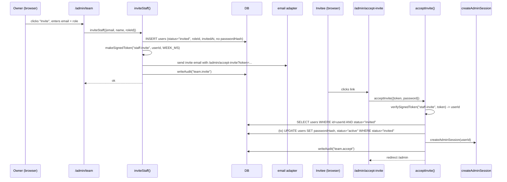
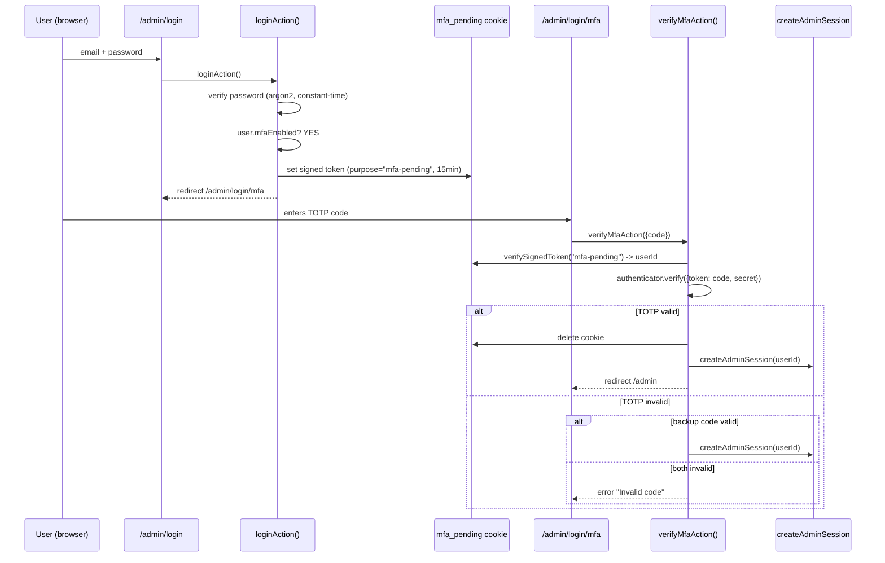
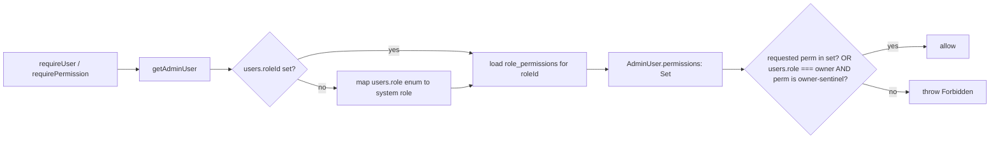

# Tech Spec — Team / Staff Management

**Status:** Planning
**Date:** 2026-07-07
**Author:** Ideation run (thought-ideation skill)
**Branch target:** `feat/team-management` (off `feat/block-style-layer`)

---

## 1. Executive summary

The platform today has a two-role admin model (`owner` / `editor`) with no staff invitation flow, no role management, no MFA, and no session management UI. The first-owner bootstrap is the only web path that creates an admin. This spec defines a full team/staff management system built on top of the existing `users` table — **linked, not merged, with `people`** — adding custom roles + a permission matrix, an email invite/accept flow, TOTP 2FA, and a session management UI.

The design preserves the existing `requireUser("owner")` call shape used in ~140 action sites by keeping the `users.role` enum as a denormalized "system class" cache and adding a `roleId` FK that is the source of truth for permissions. New code uses `requirePermission("content:publish")`; old code keeps working unchanged.

**Feasibility verdict:** Buildable in three independently-shippable tiers using only existing primitives (signed tokens, sessions, audit, argon2, rate-limit) plus two vetted new deps (`otplib`, `qrcode.react`).

**Top 3 risks:**
1. Breaking the ~140 `requireUser("owner")` call sites — mitigated by additive `AdminUser` type + backward-compat resolver.
2. MFA login branch breaking existing logins — mitigated by opt-in per user; unenrolled users hit the unchanged path.
3. Last-owner lockout — mitigated by DB-level checks in `removeStaff` / `updateStaffRole`.

**Recommended next step:** Tier 1 (schema + system roles + invite/accept + permission-aware guards). ~1 engineer-week. Demo-able: owner invites a staff member by email, the invitee accepts, logs in, and is constrained by their role's permissions.

---

## 2. Background & scope

### What was asked
A clearer, stronger team/staff management system: platform invitations, role management, and secure access, with full testing. Extend the people schema and functionality.

### What's in scope
- Custom roles + permissions matrix (system roles seeded, custom roles owner-CRUD).
- Email invitation flow with signed-token accept.
- TOTP 2FA (enroll, verify, backup codes, org-wide enforcement).
- Session management UI (list, revoke, device label).
- Account self-service (profile, change password, MFA, own sessions).
- Linking staff accounts to `people` CRM profiles (optional, nullable FK).

### What's out of scope (this pass)
- IP allowlisting for admin login.
- SSO / OAuth login (Google, GitHub) for staff — the OAuth callbacks already exist for data-source integrations, but staff SSO is deferred.
- Merging `users` into `people` — explicitly rejected (would break the documented auth boundary).
- Fine-grained per-resource ACLs (e.g. "this editor can only edit these pages") — the permission matrix is role-scoped, not resource-scoped.

### Scope decisions locked with the user
1. **Principal model — Link, don't merge.** Keep `users` as the auth principal; add nullable `personId` FK to `people`.
2. **Roles — Custom roles + permissions.** `roles` + `permissions` + `role_permissions` junction.
3. **Security — invite/accept + TOTP 2FA + session management.**
4. **Deliverable — full tech spec + plan.**

---

## 3. Architecture

### 3.1 Data flow — invitation accept



The transactional re-check of `status === "invited"` inside the UPDATE closes the token-replay race: a second accept attempt with the same token finds `status = "active"` and fails. This mirrors `first-owner.ts`'s transactional `userCount() === 0` re-check.

### 3.2 Data flow — MFA-gated login



### 3.3 Permission resolution



The Owner system role holds every permission key, so `requireUser("owner")` resolves to "does this user's role have the `team:owner` sentinel?" — which only the Owner system role has. This preserves the 140 existing call sites without rewriting them.

**Fail-closed:** if the permission lookup throws (DB error, missing role row, corrupted junction), the resolver returns an empty permission set — never `undefined` or a partial set. `requirePermission` and `requireUser("owner")` then deny. A DB outage must never degrade to "allow all." This is load-bearing: removing the try/catch would turn a DB error into an auth bypass (CWE-440 / CWE-636).

### 3.4 Module layout

```
src/modules/
├── auth/
│   ├── schema.ts              (MODIFIED: users + sessions columns)
│   ├── guards.ts              (MODIFIED: permission-aware requireUser + requirePermission)
│   ├── session.ts             (MODIFIED: AdminUser gains permissions Set)
│   ├── actions.ts             (MODIFIED: MFA branch in loginAction)
│   ├── session-actions.ts     (NEW: listSessions, revokeSession, revokeOtherSessions)
│   └── mfa/                   (NEW sub-module, mirrors auth/api-tokens/ shape)
│       ├── schema.ts          (userMfa, userBackupCodes)
│       ├── totp.ts            (encrypt/decrypt secret, verify code)
│       ├── backup-codes.ts    (generate, hash, verify, consume)
│       ├── actions.ts         (enrollMfa, verifyMfaEnroll, disableMfa, regenerateBackupCodes)
│       └── guards.ts          (MFA enforcement check used by getAdminUser)
└── team/                      (NEW top-level module)
    ├── schema.ts              (roles, permissions, rolePermissions)
    ├── permissions.ts         (PERMISSION_CATALOG: fixed ~20 keys)
    ├── seed.ts                (system roles + permission assignments)
    ├── actions.ts             (inviteStaff, acceptInvite, updateStaffRole, disableStaff, removeStaff, resendInvite)
    ├── roles-actions.ts       (createRole, updateRole, deleteRole, setRolePermissions)
    ├── queries.ts             (listStaff, getStaff, listRoles, getRoleWithPermissions)
    ├── validation.ts          (zod schemas)
    ├── tokens.ts              (re-export auth/tokens helpers, or thin wrappers)
    └── admin/                 (UI components)
        ├── TeamScreen.tsx
        ├── StaffDetail.tsx
        ├── InviteStaffButton.tsx
        ├── RolesScreen.tsx
        ├── RoleEditor.tsx
        └── PermissionMatrix.tsx
```

New routes:
```
src/app/admin/
├── (panel)/team/page.tsx              (list — team:manage)
├── (panel)/team/[id]/page.tsx         (detail — team:manage)
├── (panel)/team/roles/page.tsx        (roles list — team:roles:manage)
├── (panel)/team/roles/[id]/page.tsx   (role editor — team:roles:manage)
├── (panel)/account/page.tsx           (self-service — any logged-in admin)
├── accept-invite/page.tsx             (PUBLIC — token-gated, sets password)
└── login/mfa/page.tsx                 (PUBLIC — MFA challenge after password OK)
```

### 3.5 Reusable abstraction principle (zero call-site edits)

The core design principle across this entire feature: **one abstraction, zero call-site edits.** The permission system is the single choke point — no existing action should need modification, and new actions should use reusable wrappers instead of inline auth boilerplate.

#### Server-side: `withPermission()` wrapper

Instead of every new server action manually calling `requirePermission(key)` at the top, provide a reusable wrapper that handles auth + authz + audit in one call:

```ts
// src/modules/auth/guards.ts — reusable wrapper
export function withPermission<TArgs extends unknown[], TResult>(
  permission: string,
  fn: (user: AdminUser, ...args: TArgs) => Promise<TResult>,
): (...args: TArgs) => Promise<TResult> {
  return async (...args: TArgs) => {
    const user = await requirePermission(permission);
    return fn(user, ...args);
  };
}

// Usage in team/actions.ts — no inline auth boilerplate
export const createRole = withPermission("team:roles:manage",
  async (user, input: CreateRoleInput) => { /* ... */ });
```

This means:
- **Existing 140 `requireUser("owner")` call sites**: untouched. The backward-compat resolver in `requireUser` handles them.
- **New actions**: one line (`withPermission("key", async (user, ...) => ...)`) instead of three (require + check + throw).
- **Future permission changes**: edit the resolver or the catalog once, not 140 files.

#### Client-side: `<PermissionGate>` + `usePermissions()`

A reusable React component and hook so UI-level gating doesn't require per-component permission logic:

```tsx
// src/modules/auth/PermissionGate.tsx
"use client";
import { usePermissions } from "./usePermissions";

export function PermissionGate({ perm, children, fallback = null }:
  { perm: string; children: ReactNode; fallback?: ReactNode }) {
  const perms = usePermissions();
  return perms.has(perm) ? <>{children}</> : <>{fallback}</>;
}

// Usage in AdminTopBar — no inline permission check
<PermissionGate perm="team:manage">
  <NavItem href="/admin/team">Team</NavItem>
</PermissionGate>
```

`usePermissions()` reads the permission set from the server-component layout (already loaded in `getAdminUser`) and passes it through React context — no extra DB query per component.

#### Test-side: `createTestUser()` helper

A reusable test factory so every test file doesn't repeat the mock-setup boilerplate:

```ts
// src/modules/auth/test-helpers.ts
export async function createTestUser(db: Db, opts?: {
  role?: "owner" | "editor" | "custom";
  roleId?: string;
  permissions?: string[];
  status?: "active" | "invited" | "disabled";
  mfaEnabled?: boolean;
}): Promise<{ user: AdminUser; password: string }> { /* ... */ }
```

Every test file imports this instead of hand-rolling user fixtures. When the `AdminUser` type changes, only the helper changes — not every test file.

#### Principle applied across the spec

| Surface | Abstraction | Call sites saved |
|---|---|---|
| Server action auth | `withPermission()` wrapper | New actions: 1 line vs 3; existing 140: 0 edits |
| Client UI gating | `<PermissionGate>` + `usePermissions()` | Every nav item / button: 0 inline checks |
| Test user setup | `createTestUser()` factory | Every test file: 1 import vs 15 lines |
| Permission resolver | Single `resolvePermissions(userId)` function | 140 existing + all new: 1 choke point |
| Token signing | Reuse `auth/tokens.ts` (new `purpose` strings) | 0 new crypto code |
| Session management | Reuse `sessions` table + `destroyAllSessionsForUser` | 0 new session infrastructure |
| Audit logging | Reuse `writeAudit()` (new action vocabulary) | 0 new audit infrastructure |
| Rate limiting | Reuse `loginAttempts` table shape | 0 new limiter infrastructure |

---

## 4. Schema changes

See `migrations/README.md` for the full drizzle-kit workflow and exact column definitions. Summary:

**Modified — `src/modules/auth/schema.ts`:**
- `users`: add `personId` (nullable FK → people), `roleId` (nullable FK → roles), `invitedAt`, `mfaEnforcedAt`. Keep `role` enum as cache.
- `sessions`: add `label` (optional device label).

**New — `src/modules/team/schema.ts`:** `roles`, `permissions`, `role_permissions` (composite PK junction).

**New — `src/modules/auth/mfa/schema.ts`:** `user_mfa` (1:1 with users, encrypted secret), `user_backup_codes` (single-use, hashed).

**Seed (not migration):** `seed/team.ts` inserts the permission catalog, five system roles, system role → permission assignments, and backfills `users.roleId` for existing rows.

All schema is drizzle-idiomatic (`sqliteTable`, `text`, `integer`, `primaryKey` composite, `mode: "boolean"`) — Postgres-swap-clean.

---

## 5. API contracts

All server actions return `Result<T>` (`{ ok: true; data?: T } | { ok: false; error: string }`), matching the existing `people/admin-actions.ts` convention. FormData-based actions (login, accept-invite) return `{ error?: string }` / `{ message?: string }`, matching `auth/actions.ts`.

**Security note (CWE-862/863):** every Server Action below is a network-reachable POST endpoint. The `requireUser()` / `requirePermission()` / `withPermission()` call at the top of each action is the auth boundary — not the UI that calls it. No action relies on middleware or layout-level gating as its sole auth check. Object-level authz (IDOR) is called out per-action where an ID is supplied.

### 5.1 Team actions — `src/modules/team/actions.ts`

```ts
inviteStaff(input: { email: string; name: string; roleId: string; personId?: string })
  : Promise<Result<{ id: string; token: string }>>
  // team:manage. Creates users row status="invited", roleId, invitedAt.
  // Sends signed-token invite email. Dedup on email. Audit team.invite.
  // SECURITY: roleId must be validated against the roles table — reject if the
  //   target role has the `team:owner` sentinel and the caller is not an owner
  //   (CWE-269 privilege escalation via role injection).

acceptInvite(_prev, formData): Promise<{ error?: string }>
  // PUBLIC (token-gated). Verifies staff-invite token, sets password (min 12),
  // flips status invited->active inside a tx (re-check to close replay race),
  // creates admin session, audit team.accept, redirect /admin.
  // SECURITY: the invitee CANNOT set their own roleId — it was fixed at invite
  //   time and is not accepted from the form (CWE-269 mass-assignment). The
  //   token payload is the userId only; role is read from the DB row, not the
  //   request (CWE-307 replay + CWE-639 IDOR).

updateStaffRole(userId: string, roleId: string): Promise<Result>
  // team:manage. Last-owner protection: cannot change the only owner's role.
  // Revokes all other sessions for the user. Audit team.role.update.
  // SECURITY: roleId validated against roles table; if target role has
  //   `team:owner` sentinel, caller must also be owner (CWE-269). Cannot
  //   change own role (CWE-306 self-escalation).

disableStaff(userId: string): Promise<Result>
  // team:manage. Sets status="disabled", destroys all sessions.
  // Last-owner protection. Audit team.disable.
  // SECURITY: cannot disable self (CWE-306 self-lockout-as-DoS).

removeStaff(userId: string): Promise<Result>
  // team:manage (or team:owner sentinel). Deletes the user, cascades sessions +
  // user_mfa + user_backup_codes. Last-owner protection. Cannot remove self.
  // Audit team.remove.
  // SECURITY: cannot remove self; cannot remove last owner (CWE-306).

resendInvite(userId: string): Promise<Result>
  // team:manage. Only if status="invited". Rotates invitedAt, sends a fresh token.
  // Audit team.invite.resend.
  // SECURITY: the old token is implicitly invalidated by the status check
  //   (accept flips to "active"), but the new token has a fresh expiry.
```

### 5.2 Roles actions — `src/modules/team/roles-actions.ts`

```ts
createRole(input: { name: string; description?: string; requireMfa?: boolean }): Promise<Result<{ id: string }>>
updateRole(id: string, patch: { name?: string; description?: string; requireMfa?: boolean }): Promise<Result>
deleteRole(id: string): Promise<Result>
  // team:roles:manage. System roles (isSystem=true) reject all three.
  // Delete reassigns affected users to the Viewer system role (safe default).
setRolePermissions(roleId: string, permissionKeys: string[]): Promise<Result>
  // team:roles:manage. System roles reject (permissions are seed-controlled).
  // Diff + insert/delete role_permissions. Audit team.role.permissions.update.
```

### 5.3 MFA actions — `src/modules/auth/mfa/actions.ts`

```ts
enrollMfa(): Promise<Result<{ otpauthUri: string; backupCodes: string[] }>>
  // any logged-in admin. Generates secret, encrypts, stores in user_mfa (NOT yet
  // considered enabled — see verifyMfaEnroll). Returns otpauth URI + 10 backup
  // codes (shown once). Audit mfa.enroll-start.
  // SECURITY: secret encrypted at rest (AES-256-GCM, HKDF key); backup codes
  //   hashed (SHA-256) before storage; neither logged in audit meta
  //   (CWE-312 cleartext storage, CWE-532 log injection of secrets).

verifyMfaEnroll(code: string): Promise<Result>
  // any logged-in admin. Confirms enrollment by verifying a TOTP code against
  // the stored secret. On success, MFA is "enabled" for the user. Audit mfa.enroll.
  // SECURITY: rate-limited via loginAttempts table (CWE-307 brute-force).

disableMfa(password: string): Promise<Result>
  // any logged-in admin. Requires re-entry of the account password (re-auth).
  // Deletes user_mfa + all backup codes. Destroys all other sessions. Audit mfa.disable.
  // SECURITY: re-auth prevents session-hijack-based MFA disabling (CWE-384).

regenerateBackupCodes(password: string): Promise<Result<{ codes: string[] }>>
  // any logged-in admin. Re-auth required. Deletes old codes, mints 10 new.
  // Audit mfa.backup-codes.regenerate.
  // SECURITY: re-auth; old codes invalidated atomically; new codes hashed.

verifyMfaAction(_prev, formData): Promise<{ error?: string }>
  // PUBLIC (mfa_pending cookie-gated). Verifies TOTP or backup code, creates
  // admin session, deletes pending cookie. Audit auth.login.mfa or .mfa-backup.
  // SECURITY: mfa_pending cookie is single-purpose (only this action consumes
  //   it); 15-min TTL; 3 failed attempts clears cookie + forces re-login
  //   (CWE-307 brute-force, CWE-384 session fixation). Backup code consume is
  //   atomic (SELECT + UPDATE usedAt in one tx) — no double-spend race.
```

### 5.4 Session actions — `src/modules/auth/session-actions.ts`

```ts
listSessions(userId: string): Promise<Result<SessionRow[]>>
  // any logged-in admin (self only) OR team:manage (any user).
  // SessionRow: { id, createdAt, expiresAt, ip, userAgent, label, isCurrent }
  // SECURITY: if caller is not team:manage, userId must equal caller's id
  //   (CWE-639 IDOR — cannot list another user's sessions).

revokeSession(sessionId: string): Promise<Result>
  // self or team:manage. Deletes the session row. Cannot revoke the current
  // session through this action (use logoutAction for that). Audit session.revoke.
  // SECURITY: verify the session's userId matches the caller's id OR caller has
  //   team:manage — lookup by (sessionId, userId) for self, not just sessionId
  //   (CWE-639 IDOR — cannot revoke another user's session without team:manage).

revokeOtherSessions(): Promise<Result>
  // self. Destroys every admin session for the current user except the current
  // one. Audit session.revoke-others.
  // SECURITY: no userId argument — always scoped to the caller (no IDOR surface).
```

### 5.5 Permission catalog — `src/modules/team/permissions.ts`

Fixed, code-controlled catalog (~20 keys). Extensible only by editing this file + re-seeding. Examples:

| Key | Description |
|---|---|
| `team:owner` | Sentinel — only the Owner system role. Backward-compat for `requireUser("owner")`. |
| `team:manage` | Invite/disable/remove staff, view team list |
| `team:roles:manage` | Create/edit/delete custom roles, assign permissions |
| `content:publish` | Publish entries (vs draft-only) |
| `content:delete` | Delete entries |
| `content:templates` | Edit content types / templates |
| `people:read` | View the CRM |
| `people:write` | Edit person contact fields, tags |
| `people:delete` | Delete people (currently owner-only) |
| `commerce:manage` | Products, collections, orders, shipping |
| `commerce:refund` | Issue refunds |
| `design:manage` | Theme, fonts, blocks, design packs |
| `settings:manage` | Site settings, integrations, domain |
| `reviews:moderate` | Moderate reviews |
| `media:manage` | Upload/delete media |
| `analytics:view` | View analytics |
| `import:run` | Run content importers |
| `billing:manage` | Billing / Stripe settings |
| `api:tokens:manage` | Create/revoke API tokens |
| `mfa:self` | Enroll/disable own MFA (every admin has this) |

System role → permission assignments (seeded):
- **Owner** — every key.
- **Editor** — everything except `team:*`, `billing:manage`, `settings:manage`, `api:tokens:manage`.
- **Author** — `content:publish` (own), `media:manage`, `mfa:self`.
- **Moderator** — `reviews:moderate`, `people:read`, `people:write`, `mfa:self`.
- **Viewer** — `people:read`, `analytics:view`, `mfa:self`.

---

## 6. Per-platform implementation notes

This is a web-only feature (admin panel). No iOS/macOS/Android native surface. The Swift app (`app-swift/`) consumes the platform via API tokens (`requireApiUser`); the permission model extends to bearer-token auth automatically because `requireApiUser` shares the resolver.

### 6.1 Web (Next.js admin panel)

- **Server components** for list/detail pages (direct DB reads via `queries.ts`).
- **Client components** for interactive UI (invite form, role editor, permission matrix, MFA enroll). Use `useTransition` + `router.refresh()` pattern from `people/admin/InviteButton.tsx`.
- **Server actions** for all mutations, each calling `requireUser()` / `requirePermission()` at the top.
- **Form actions** (`<form action={...}>`) for login, accept-invite, MFA challenge — matching `auth/actions.ts` shape.
- **AdminTopBar** gains a "Team" nav item in the settings bucket, gated by `team:manage`. The account self-service link (`/admin/account`) is shown for every logged-in admin.

### 6.2 API (bearer-token auth)

`requireApiUser(role?: "owner")` in `src/modules/auth/api-tokens/guards.ts` gets the same permission-aware extension as `requireUser`. New: `requireApiPermission(key: string)`. No API endpoint changes are required for Tier 1 — the existing `/api/v1/*` routes keep working. Future API endpoints for team management (e.g. `/api/v1/team/staff`) can be added in Tier 2 if the Swift app needs them.

### 6.3 Entitlements / distribution

No native entitlements. No App Store review risk. The only external constraint is email deliverability for invitations (reuse the existing `@/adapters/email` adapter — no new integration).

---

## 7. Phased rollout

### Tier 1 — Foundation (Size: M, ~1 engineer-week)
**Demo-able milestone:** owner invites a staff member by email; invitee accepts, sets password, logs in, and is constrained by their system role's permissions.

Deliverables:
- Schema deltas (`users` columns, `roles`/`permissions`/`role_permissions`).
- `team/permissions.ts` catalog + `seed/team.ts` (system roles + assignments + existing-user backfill).
- Permission-aware `requireUser` + new `requirePermission` (backward-compat preserved).
- `AdminUser` type extended with `permissions: Set<string>`.
- `team/actions.ts`: `inviteStaff`, `acceptInvite`, `updateStaffRole`, `disableStaff`, `removeStaff`, `resendInvite` (with last-owner protection).
- Routes: `/admin/accept-invite`, `/admin/team`, `/admin/team/[id]`.
- AdminTopBar "Team" nav item.
- Tests: `team/actions.test.ts`, `auth/guards.test.ts` (full coverage per §8).

**Out of Tier 1:** custom role CRUD, session management UI, MFA, account self-service.

### Tier 2 — Custom roles + session management + self-service (Size: M, ~1 engineer-week)
**Demo-able milestone:** owner creates a custom role "Content Lead" with a chosen permission subset, assigns it to a staff member, and the staff member can list/revoke their own sessions from `/admin/account`.

Deliverables:
- `team/roles-actions.ts`: `createRole`, `updateRole`, `deleteRole` (system-role lock), `setRolePermissions`.
- Routes: `/admin/team/roles`, `/admin/team/roles/[id]` with `PermissionMatrix` UI.
- `sessions.label` column + `auth/session-actions.ts`: `listSessions`, `revokeSession`, `revokeOtherSessions`.
- `/admin/account` self-service: profile, change password (reuse `auth/password.ts`), own sessions.
- Auto-revoke other sessions on role downgrade / disable / password change.
- Tests: `team/roles-actions.test.ts`, `auth/session-actions.test.ts`.

### Tier 3 — TOTP 2FA (Size: L, ~1.5 engineer-weeks)
**Demo-able milestone:** a staff member enrolls an authenticator app from `/admin/account`, sees backup codes, logs out, and the next login requires a TOTP code. Owner can flip org-wide `mfaRequired` and unenrolled staff are forced to enroll within a grace period.

Deliverables:
- Add deps `otplib@^13.4.0`, `qrcode.react`.
- `auth/mfa/` sub-module: schema, totp (AES-GCM encrypt/decrypt), backup-codes, actions.
- `loginAction` MFA branch + `mfa_pending` cookie + `/admin/login/mfa` challenge + `verifyMfaAction`.
- `team.mfaRequired` setting (people-settings pattern) + per-role `requireMfa` + enforcement in `getAdminUser`.
- `/admin/account` MFA enroll flow (QR via `qrcode.react`, backup codes display-once).
- Tests: `auth/mfa/actions.test.ts` (enroll, verify, backup code consume, login MFA branch, disable revokes sessions).

---

## 8. Testing strategy

### 8.1 Test pyramid

Following the e2e-test-engineer workflow, the test suite is layered:

| Layer | Share | Framework | What it covers |
|---|---|---|---|
| **Unit** | ~70% | Vitest | Action logic, permission resolver, token verify, TOTP encrypt/decrypt, backup code hash/consume, zod validation |
| **Integration** | ~20% | Vitest (temp DB) | Full action flows against a file-backed temp DB with real drizzle queries — invite→accept, role CRUD, MFA enroll→verify, session revoke |
| **E2E** | ~10% | Playwright | Critical user journeys through the real browser: invite→accept→login, MFA enroll→logout→MFA login, permission enforcement in panel |

The codebase already has Vitest (`npm test`) and Playwright (`npm run test:e2e`). No new test runner is needed.

### 8.2 Reusable test infrastructure

All test files share a single test helper to avoid boilerplate duplication (per §3.5):

```ts
// src/modules/auth/test-helpers.ts
export async function createTestUser(db: Db, opts?: {
  role?: "owner" | "editor" | "custom";
  roleId?: string;
  permissions?: string[];      // inserts a custom role + permissions if role="custom"
  status?: "active" | "invited" | "disabled";
  mfaEnabled?: boolean;        // inserts user_mfa + backup codes if true
  password?: string;           // defaults to "test-password-123"
}): Promise<{ user: AdminUser; userId: string; password: string }>

export async function createTestSession(db: Db, userId: string, opts?: {
  label?: string;
  expiresAt?: number;
  isCurrent?: boolean;
}): Promise<{ sessionId: string; token: string }>

export function setupTestDb(): Promise<{ db: Db; cleanup: () => void }>
// Wraps the mkdtempSync + createClient + migrate + vi.mock pattern from
// first-owner.test.ts into one reusable function.
```

Every test file calls `setupTestDb()` in `beforeEach` and `cleanup()` in `afterEach`. When the `AdminUser` type or DB schema changes, only `test-helpers.ts` changes — not every test file.

### 8.3 Unit + integration tests (Vitest)

Mirror `auth/first-owner.test.ts` exactly: file-backed temp DB, `migrate(testDb, { migrationsFolder: "./drizzle" })`, mock `next/navigation` + `next/headers` + `@/modules/audit/log`.

#### `team/actions.test.ts`
- `inviteStaff`: owner-only (editor 403s), email dedup, creates `status="invited"` row with `roleId` + `invitedAt`, no `passwordHash`, sends email, audits.
- `inviteStaff` privilege escalation: editor cannot invite with an Owner-role `roleId` (CWE-269).
- `acceptInvite`: valid token sets password + flips status + creates session + redirects; expired token rejected; already-accepted (status="active") rejected; weak password (<12) rejected; transactional replay race (two concurrent accepts → only one succeeds).
- `acceptInvite` mass-assignment: form submitting a `roleId` field is ignored — role comes from the DB row, not the request (CWE-269).
- `updateStaffRole`: changes roleId, revokes other sessions, audits; last-owner protection (cannot change the only owner's role away from Owner); cannot change own role (CWE-306).
- `updateStaffRole` privilege escalation: non-owner cannot assign a role with `team:owner` sentinel (CWE-269).
- `disableStaff`: sets status="disabled", destroys sessions; last-owner protection; cannot disable self (CWE-306).
- `removeStaff`: deletes user + cascades mfa/backup-codes/sessions; cannot remove self; cannot remove last owner.
- `resendInvite`: only if status="invited", rotates `invitedAt`, sends fresh token.

#### `team/roles-actions.test.ts`
- `createRole`: inserts with `isSystem=false`.
- `updateRole` / `deleteRole`: system roles (`isSystem=true`) reject with error; delete reassigns affected users to Viewer.
- `setRolePermissions`: system roles reject; custom role diff + junction update correct; audit written.
- `setRolePermissions` invalid keys: permission keys not in the catalog are rejected (CWE-20 input validation).

#### `auth/guards.test.ts`
- `requireUser()` (no arg): unauthenticated redirects to `/admin/login`; authenticated returns user.
- `requireUser("owner")` backward compat: owner passes; editor throws; custom-role user with `team:owner` perm passes; custom-role user without it throws.
- `requirePermission("content:publish")`: role with perm passes; role without perm throws; disabled user rejected.
- **Fail-closed**: DB error during permission lookup → empty set → `requirePermission` throws (CWE-440). Simulate by dropping the role_permissions table mid-test.
- `withPermission()` wrapper: wraps a function; caller without perm gets 403; caller with perm gets result; audit fires.
- Permission set is loaded once per request (no N+1).

#### `auth/mfa/actions.test.ts`
- `enrollMfa`: secret stored encrypted (assert ciphertext !== plaintext base32), returns otpauth URI + 10 backup codes.
- `enrollMfa` no-secret-in-audit: audit meta does not contain the secret or backup codes (CWE-532).
- `verifyMfaEnroll`: valid TOTP enables MFA; invalid does not; rate-limited after 5 attempts (CWE-307).
- `disableMfa`: requires correct password; wrong password rejected; deletes `user_mfa` + backup codes; destroys other sessions.
- `regenerateBackupCodes`: re-auth required; old codes invalidated; 10 new codes returned; old codes fail replay.
- Backup code consume: single-use (replay fails), hash check (DB leak alone can't use a code), atomic consume (concurrent use of same code → only one succeeds).
- Login MFA branch: enrolled user → `mfa_pending` cookie set, no admin session created; `verifyMfaAction` with valid TOTP creates session + deletes cookie; wrong code 3 times clears cookie + forces re-login; expired pending cookie rejected; `mfa_pending` cookie for user A cannot be used to create a session for user B (CWE-384).

#### `auth/session-actions.test.ts`
- `listSessions`: returns current + others; `isCurrent` flag correct.
- `listSessions` IDOR: non-team:manage caller requesting another user's sessions → rejected (CWE-639).
- `revokeSession`: deletes target, keeps current; cannot revoke non-existent; IDOR — cannot revoke another user's session without team:manage (CWE-639).
- `revokeOtherSessions`: destroys all except current.

### 8.4 E2E tests (Playwright)

Critical user journeys through the real browser. These are the "10%" at the top of the pyramid — they verify the full stack (DB → server action → cookie → redirect → UI render) end-to-end.

#### `e2e/team-invite-accept.spec.ts`
```
1. Owner logs in → navigates to /admin/team
2. Clicks "Invite", enters email + selects "Editor" role → submits
3. (mock email adapter captures the invite link)
4. New browser context → opens the invite link
5. Accept-invite page renders → enters name + password → submits
6. Redirected to /admin → Team nav item visible → Settings nav item NOT visible (Editor lacks settings:manage)
7. Navigates to /admin/people → page renders (Editor has people:read)
8. Navigates to /admin/settings → redirected or forbidden (Editor lacks settings:manage)
```

#### `e2e/team-mfa-flow.spec.ts`
```
1. Staff member logs in → navigates to /admin/account
2. Clicks "Enable 2FA" → QR code renders → enters TOTP code from test authenticator
3. Backup codes displayed → confirms → MFA enabled
4. Logs out → logs in with email + password
5. Redirected to /admin/login/mfa → enters TOTP code → redirected to /admin
6. (negative) wrong TOTP code 3 times → redirected to /admin/login
```

#### `e2e/team-session-management.spec.ts`
```
1. Staff member logs in from browser A → navigates to /admin/account
2. Sees 1 active session (current, labeled "Chrome on macOS")
3. Opens browser B → logs in → sees 2 sessions
4. From browser B → revokes browser A's session
5. Browser A → next request → redirected to /admin/login (session invalidated)
```

#### `e2e/team-permission-enforcement.spec.ts`
```
1. Owner creates custom role "Content Lead" with content:publish + media:manage only
2. Invites staff member with that role → accepts → logs in
3. Staff member → /admin/pages → can publish (button visible)
4. Staff member → /admin/settings → forbidden (no settings:manage)
5. Staff member → /admin/team → forbidden (no team:manage)
6. Owner → revokes content:publish from the role
7. Staff member → /admin/pages → publish button gone (PermissionGate hides it)
```

### 8.5 Coverage thresholds

```ts
// vitest.config.ts — higher thresholds for critical auth modules
coverage: {
  thresholds: {
    global: { branches: 80, functions: 80, lines: 80, statements: 80 },
    './src/modules/auth/': { branches: 90, functions: 90, lines: 90 },
    './src/modules/team/': { branches: 85, functions: 85, lines: 85 },
    './src/modules/auth/mfa/': { branches: 90, functions: 90, lines: 90 },
  },
}
```

Auth and MFA modules get 90% thresholds — a missed branch in the permission resolver or TOTP verify is a security hole, not a cosmetic gap.

### 8.6 Verification commands
```sh
npm test                 # vitest — all unit + integration tests
npm run test:e2e         # playwright — all E2E tests
npm run typecheck        # AdminUser type change doesn't break 140 call sites
npm run lint
npm run db:generate      # review generated SQL
npm run db:migrate       # apply to data/dev.db
npm run seed:reset       # system roles seed correctly
```

Manual smoke test (after automated suite passes): invite a staff member → accept → log in → verify permissions enforce in panel → enroll MFA → log out → log in with MFA → revoke a session from `/admin/account`.

---

## 9. Security hardening (secure-review findings)

This section is the output of running the spec through the secure-review skill with Sentinel's CWE-mapped attack-pattern knowledge base for the Next.js + SQLite + TypeScript stack. Each finding is mapped to a CWE and has a concrete fix. Findings are ranked by severity.

### 9.1 Critical — privilege escalation via role injection (CWE-269)

**Scenario:** an editor (who has `team:manage` in a custom role but NOT `team:owner`) calls `inviteStaff({ email, name, roleId: "<owner-role-id>" })` or `updateStaffRole(targetUserId, roleId: "<owner-role-id>")`. If the action doesn't validate the target role's permissions against the caller's, the editor can mint an owner.

**Fix (load-bearing — do NOT simplify away):**
- `inviteStaff` and `updateStaffRole` must look up the target `roleId` in the roles table, check whether it grants the `team:owner` sentinel, and if so require the caller to also have `team:owner`.
- This check is inside the action, not in the UI (Server Actions are public endpoints — CWE-862).
- Test: `team/actions.test.ts` — "editor cannot invite with Owner-role roleId" and "non-owner cannot assign team:owner role."

### 9.2 Critical — mass-assignment on accept-invite (CWE-269, CWE-915)

**Scenario:** the accept-invite form is a public POST. An attacker submits `formData.set("roleId", "<owner-role-id>")` alongside their password. If `acceptInvite` spreads the form data into the user update, the invitee self-escalates to owner.

**Fix (load-bearing):**
- `acceptInvite` reads ONLY `token` and `password` from the form. The `roleId` is read from the existing DB row (set at invite time), never from the request.
- The zod schema for `acceptInvite` explicitly lists only `{ token, password }` — no `z.object().passthrough()`.
- Test: `team/actions.test.ts` — "acceptInvite mass-assignment: form submitting roleId is ignored."

### 9.3 High — IDOR on session management (CWE-639)

**Scenario:** `revokeSession(sessionId)` is called with another user's session ID. If the action only checks "does this session exist" (not "does it belong to the caller or does the caller have team:manage"), any admin can revoke any other admin's session — a DoS vector.

**Fix (load-bearing):**
- `revokeSession` looks up the session by `(sessionId, userId)` when the caller lacks `team:manage`. The query is scoped, not just "find by id."
- `listSessions(userId)` rejects if `userId !== caller.id` and caller lacks `team:manage`.
- Test: `auth/session-actions.test.ts` — "IDOR: cannot revoke another user's session without team:manage."

### 9.4 High — fail-closed permission resolver (CWE-440, CWE-636)

**Scenario:** the permission resolver queries `role_permissions` and the DB throws (connection error, table locked, corrupted row). If the resolver returns `undefined` or propagates the exception in a way that the guard interprets as "no restriction," the action proceeds without authz.

**Fix (load-bearing — do NOT remove the try/catch):**
- `resolvePermissions(userId)` wraps the DB query in try/catch. On error, returns `new Set<string>()` (empty — deny all). The guard then throws "Forbidden."
- This is explicitly NOT simplifiable — the try/catch is defense-in-depth against DB errors becoming auth bypasses.
- Test: `auth/guards.test.ts` — "fail-closed: DB error during permission lookup → empty set → requirePermission throws."

### 9.5 High — MFA pending cookie cross-user attack (CWE-384)

**Scenario:** user A logs in with password → gets `mfa_pending` cookie for user A. Attacker steals user A's `mfa_pending` cookie and tries to use it to create a session for user B (who doesn't have MFA). If `verifyMfaAction` creates a session for the user in the form data instead of the user in the token, the attacker bypasses MFA.

**Fix (load-bearing):**
- `verifyMfaAction` reads the userId from the signed `mfa_pending` token (server-side, HMAC-verified), NEVER from the form or request body. The session is created for that userId only.
- The token's `payload` is the userId; `verifySignedToken` returns it after HMAC validation. No client-side trust.
- Test: `auth/mfa/actions.test.ts` — "mfa_pending cookie for user A cannot create session for user B."

### 9.6 Medium — backup code double-spend race (CWE-362)

**Scenario:** two concurrent requests submit the same backup code. If the "check + mark used" is not atomic, both could succeed — the code is spent twice.

**Fix (load-bearing):**
- `consumeBackupCode(userId, code)` runs in a transaction: `SELECT ... WHERE usedAt IS NULL` + `UPDATE SET usedAt = now() WHERE usedAt IS NULL`. The UPDATE's `WHERE` clause is the race-closer — only one request can flip `usedAt` from null.
- Test: `auth/mfa/actions.test.ts` — "atomic consume: concurrent use of same code → only one succeeds."

### 9.7 Medium — no secrets in audit log (CWE-532)

**Scenario:** `enrollMfa` writes `writeAudit({ action: "mfa.enroll-start", meta: { secret, backupCodes } })`. The audit log is stored in the DB — a leak exposes TOTP secrets and backup codes.

**Fix (load-bearing):**
- Audit meta for MFA actions contains only `{ method: "totp" }` or `{ method: "backup-code" }` — never the secret, the code, or the backup codes.
- The `writeAudit` function's type signature could enforce this by making `meta` a `Record<string, unknown>` but the action code must be disciplined.
- Test: `auth/mfa/actions.test.ts` — "audit meta does not contain the secret or backup codes."

### 9.8 Medium — rate-limit accept-invite and MFA verify (CWE-307)

**Scenario:** the accept-invite endpoint is public (token-gated). An attacker with a stolen token can brute-force the password field. Similarly, the MFA verify endpoint allows TOTP brute-force (only 1,000,000 possible 6-digit codes).

**Fix (load-bearing):**
- `acceptInvite` reuses `allowLoginAttempt(email, ip)` from `auth/rate-limit.ts` — the invitee's email is known from the token payload.
- `verifyMfaAction` reuses `allowLoginAttempt(userId, ip)` — keyed by the pending token's userId.
- MFA verify additionally enforces a hard 3-attempt limit per pending cookie (clears the cookie after 3 fails, forcing re-login).
- TOTP has 1M possible codes / 30-second window → 3 guesses is negligible. Backup codes are 10 single-use → 3 guesses is also negligible.
- Test: `auth/mfa/actions.test.ts` — "rate-limited after attempts" and "3 failed attempts clears cookie."

### 9.9 Low — constant-time backup code comparison (CWE-208)

**Scenario:** backup code hashes are compared with `===` (string equality). If the hash comparison short-circuits on length mismatch, an attacker can time the response to learn the hash length.

**Fix (defense-in-depth):**
- Use `timingSafeEqual` for backup code hash comparison, same as `auth/tokens.ts` uses for signed-token verification.
- This is low severity because the codes are single-use and hashed, but it's free to do correctly.

### 9.10 Summary — what the spec already gets right

The original spec (before this review) already addressed:
- TOTP secret encryption at rest (AES-256-GCM) — §3, `research/totp-platform-research.md`
- Token replay on invite accept (transactional status re-check) — §3.1
- MFA pending cookie single-purpose + 15-min TTL — §3.2
- Backup code single-use + hashed at rest — `research/totp-platform-research.md`
- Last-owner protection (DB-level checks) — §5
- `otplib` supply-chain vetting (pinned, >7-day rule) — `research/totp-platform-research.md`

This review adds: privilege escalation guards (9.1, 9.2), IDOR on sessions (9.3), fail-closed resolver (9.4), MFA cross-user attack (9.5), backup code race (9.6), audit log hygiene (9.7), rate-limiting public endpoints (9.8), constant-time comparison (9.9).

---

## 10. Risks & mitigations

| Risk | Likelihood | Impact | Mitigation |
|---|---|---|---|
| Breaking ~140 `requireUser("owner")` call sites | M | H | Additive `AdminUser` type; backward-compat resolver; `typecheck` catches any breakage |
| MFA login branch breaks existing logins | L | H | MFA is opt-in per user; unenrolled users hit the unchanged path; covered by `auth/actions.test.ts` |
| Last-owner lockout | M | H | DB-level checks in `removeStaff` / `updateStaffRole` / `disableStaff`; UI disables the control when user is the only owner |
| `users.role` enum + `roleId` denormalization drift | M | M | Every action sets both together; `role` enum is a "system class" marker, `roleId` is permission source of truth; seed backfills existing rows |
| `otplib` supply-chain / age | L | M | Pin `^13.4.0` (stable for years, >7-day rule satisfied); not `latest` |
| TOTP secret plaintext leak | L | H | AES-256-GCM encryption at rest with HKDF-derived key; dev fallback warns |
| Token replay on invite accept | L | M | Transactional `status="invited"` re-check inside UPDATE; replay finds `status="active"` and fails |
| MFA pending cookie misuse | M | H | Single-purpose token (only `verifyMfaAction` consumes); 15-min TTL; cleared on success / 3-fail / expiry |
| Backup code replay | L | M | Single-use (`usedAt` set on consume); hash at rest; replay fails |
| Email deliverability for invites | M | L | Reuse existing `@/adapters/email`; no new integration; resend action for retry |

---

## 11. Open questions (need user/stakeholder input before Tier 1 code commit)

1. **First-owner `personId` link:** should `createFirstOwner` also create + link a `people` profile row (for activity-timeline continuity)? **Default: yes** — the owner gets a CRM profile linked to their `users` row, so admin actions can appear in the same activity feed.
2. **Permission catalog granularity:** fixed ~20 keys (extensible via code + re-seed) vs freeform owner-defined keys? **Default: fixed catalog.** Freeform keys make the permission matrix UI unbounded and risk typo-driven holes.
3. **MFA enforcement scope:** org-wide `mfaRequired` setting + per-role `requireMfa` override? **Default: yes** — org-wide is the blunt instrument, per-role is the scalpel (e.g. require MFA only for Owner + Editor).
4. **Invited-staff name mutability:** can an invited staff member set their own name on accept, or is the owner-set name final? **Default: owner-set, editable later by the staff member from `/admin/account`.** This avoids the invitee mistyping their own name during a hurried accept.
5. **Grace period for MFA enforcement:** 7 days from `mfaEnforcedAt` before `getAdminUser` starts rejecting unenrolled staff? **Default: 7 days.** Long enough to not surprise, short enough to not leave a hole.

---

## 12. References

- `src/modules/auth/schema.ts` — current `users` + `sessions` schema
- `src/modules/auth/guards.ts` — `requireUser` (the ~140-call-site surface)
- `src/modules/auth/session.ts` — `AdminUser` type, `createAdminSession`, `destroyAllSessionsForUser`
- `src/modules/auth/tokens.ts` — signed HMAC token primitives (reused for staff-invite + mfa-pending)
- `src/modules/auth/first-owner.ts` — install bootstrap (template for `acceptInvite`)
- `src/modules/auth/first-owner.test.ts` — test recipe (temp DB + mocks)
- `src/modules/auth/api-tokens/` — sub-module structural template (mirrored by `auth/mfa/`)
- `src/modules/people/schema.ts` — CRM table (`personId` FK target)
- `src/modules/people/admin-actions.ts` — `inviteMember` (reader invite; structural reference)
- `src/modules/people/people-settings.ts` — settings pattern (mirrored by `team` settings)
- `src/modules/audit/log.ts` — `writeAudit` (reused with new action vocabulary)
- `src/lib/db/schema/index.ts` — aggregated schema barrel (re-exports new modules)
- `docs/recipes/swap-database-to-postgres.md` — Postgres-swap-clean invariant
- `docs/features/planning/reviews-2026-07-06/migrations/README.md` — migration convention reference
- `research/codebase-audit.md` — full primitive + call-site survey
- `research/totp-platform-research.md` — otplib/qrcode vetting + RFC 6238 + backup-code best practice
- Sentinel security knowledge base — CWE-mapped attack patterns for Next.js Server Actions (CWE-862/863), privilege escalation (CWE-269), IDOR (CWE-639), fail-closed (CWE-440), MFA session fixation (CWE-384), token replay (CWE-307), secrets in logs (CWE-532), backup code race (CWE-362), constant-time comparison (CWE-208)
- RFC 6238 (TOTP): https://datatracker.ietf.org/doc/html/rfc6238
- otplib: https://github.com/yeojz/otplib
- qrcode.react: https://www.npmjs.com/package/qrcode.react
